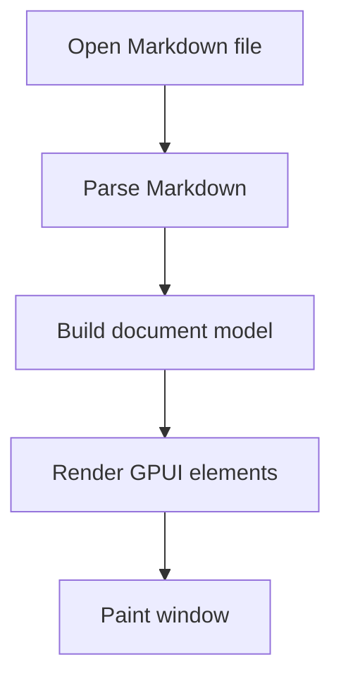
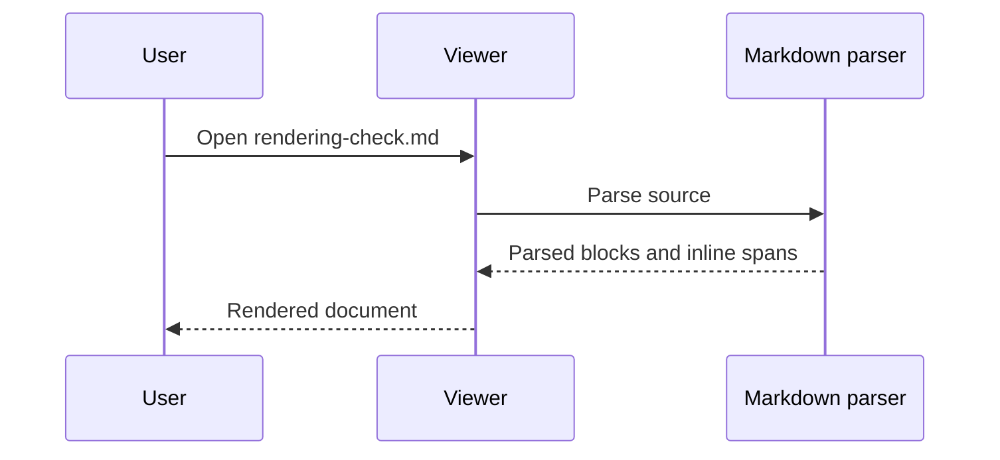

# Rendering Check

This file is intended for manual verification of the standalone Markdown viewer.

## Basic Text

This paragraph includes **bold**, *italic*, ~~strikethrough~~, `inline code`, a [local link](README.md), and an [external link](https://github.com/).

> Block quotes should preserve spacing, wrapping, and nested inline formatting such as `code` and **bold** text.

## Lists

- Unordered item one
- Unordered item two
  - Nested item
  - Nested item with `code`
- Unordered item three

1. Ordered item one
2. Ordered item two
3. Ordered item three

- [x] Completed task
- [ ] Incomplete task

## Table

| Feature | Example | Expected |
| :-- | :-- | --: |
| Inline code | `cargo build -p markdown_viewer` | right-aligned cell |
| Link | [README](README.md) | local file link |
| Math | $E = mc^2$ | inline math in table |
| Math source | `$E = mc^2$` | literal math source |
| Escaped pipe | a \| b | literal pipe |

## Code Blocks

```rust
use std::path::PathBuf;

fn load_file(path: PathBuf) -> anyhow::Result<String> {
    let source = std::fs::read_to_string(&path)?;
    Ok(source)
}
```

```json
{
  "theme": "One Light",
  "render_math": true,
  "render_mermaid_diagrams": true,
  "read_only": true
}
```

```powershell
cargo run -p markdown_viewer -- .\rendering-check.md
```

## Mermaid





## Inline Math

The quadratic formula is $x = \frac{-b \pm \sqrt{b^2 - 4ac}}{2a}$.

The constants $\pi \approx 3.14159$ and $e \approx 2.71828$ should appear with stable glyph metrics.

The cross product is $\mathbf{a} \times \mathbf{b}$.

The Fourier transform is $\hat{f}(\xi) = \int_{-\infty}^{\infty} f(x)e^{-2\pi i x \xi}\,dx$.

## Block Math

Euler's identity:

$$
e^{i\pi} + 1 = 0
$$

Maxwell equations:

$$
\nabla \cdot \mathbf{E} = \frac{\rho}{\varepsilon_0}
$$

$$
\nabla \cdot \mathbf{B} = 0
$$

$$
\nabla \times \mathbf{E} = -\frac{\partial \mathbf{B}}{\partial t}
$$

$$
\nabla \times \mathbf{B} = \mu_0 \mathbf{J} + \mu_0 \varepsilon_0 \frac{\partial \mathbf{E}}{\partial t}
$$

Gaussian integral:

$$
\int_{-\infty}^{\infty} e^{-x^2} \, dx = \sqrt{\pi}
$$

A matrix with delimiters that usually falls back to `Size` fonts:

$$
A =
\begin{bmatrix}
1 & 2 & 3 \\
4 & 5 & 6 \\
7 & 8 & 9
\end{bmatrix}
$$

A script and calligraphic sample:

$$
\mathcal{L}\{f\}(s) = \int_0^\infty f(t)e^{-st}\,dt
$$

$$
\mathscr{F}\{f\}(\xi) = \int_{-\infty}^{\infty} f(x)e^{-2\pi i x \xi}\,dx
$$

$$
\mathfrak{g} \subseteq \mathfrak{gl}_n(\mathbb{C})
$$

A summation, product, and limit sample:

$$
\sum_{k=1}^{n} k = \frac{n(n+1)}{2}, \qquad
\prod_{k=1}^{n} k = n!, \qquad
\lim_{x \to 0} \frac{\sin x}{x} = 1
$$

## Mixed Content

| Section | Snippet |
| :-- | :-- |
| Mermaid | See the two fenced diagrams above. |
| Rust | See the fenced Rust sample above. |
| Math | $\sqrt{2}$, $\hat{f}$, $\times$, $\int_a^b$, $\sum_{k=1}^{n}$ |

Final paragraph for scrolling verification. Repeatable content helps confirm line spacing, selection behavior, copy behavior, and long-document scrolling without introducing additional rendering features.
